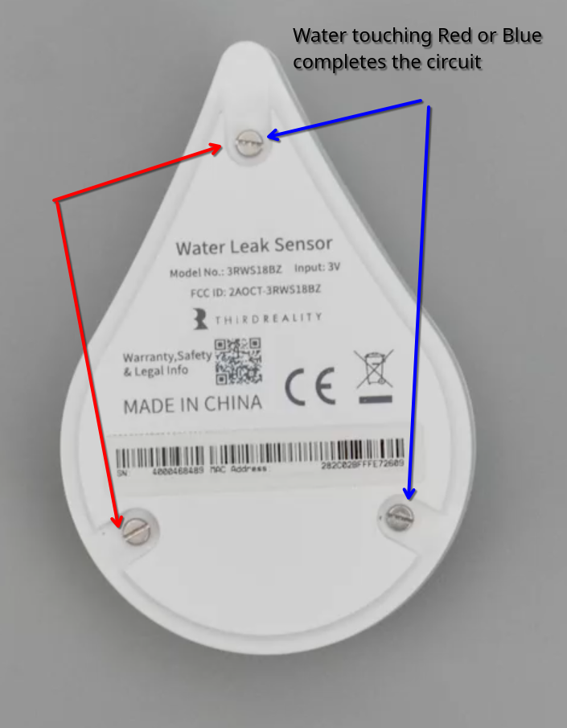
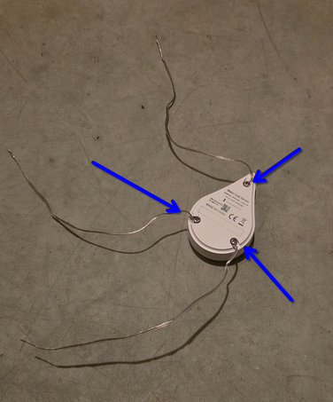
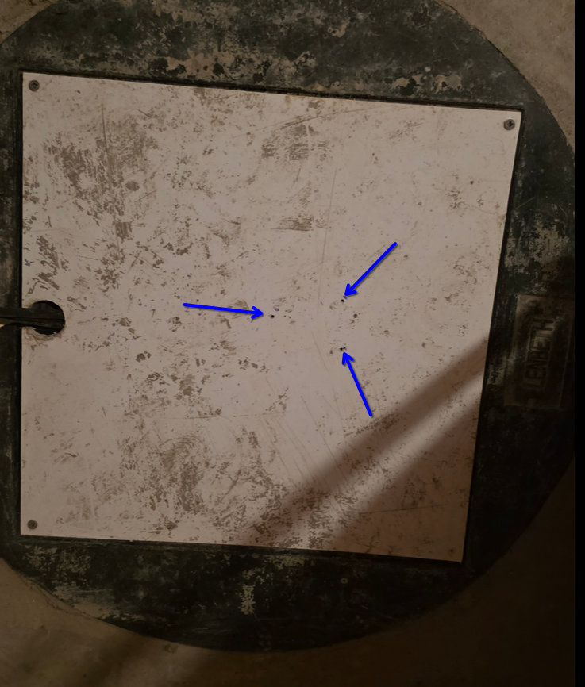
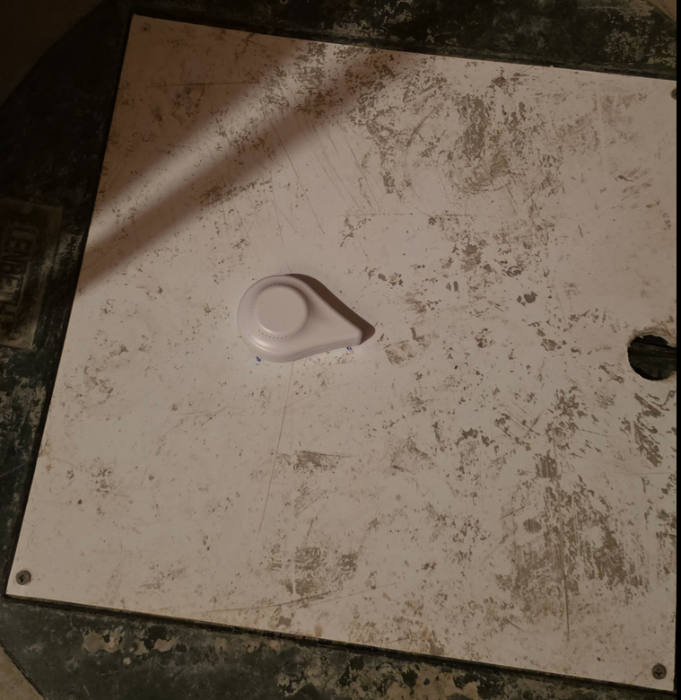

+++
title = "Extending Zigbee Flood Sensor"
date = "2026-07-05"
slug = "modding-flood-sensor"
+++
# Objective

With yellow warning flooding risk,incessant rains, and sump pump activating so frequently: I wanted some kind of indication if the basement flooded.

# Problem Statement

There are Zigbee water leak sensors that look like an egg, where water touches two (out of three) the circuit completes, it beeps and the respective entity in HomeAssistant activates.

So far so good, but this is a reactive measure. If I keep it in furnace room floor, the notification and its subsequent automation kicks off when the flooding has already begun. At this point the damage is already done.

There are other flood sensors which have a dongle that hangs out of a module, but they are either with extremely long shipping times or not zigbee compatabile or not home assistant compatible.

# Solution - Or I think it is

Since completing the circuit is the trigger point, it doesnt matter what completes the circuit as long as it can. 

I took speaker wires, cut them to a considerable length and splayed the stereo lines into two individual wires. Then attached those wires to the contact sensors at the back. This was extremely easy because they are just screws.

Lowering these wires from the sensor into the sump pump reservoir should make it proactive in the sense that the alarm will go off when water level is rising and touches the wires. 

> **Note:**
> - Sorry reader, you have to witness my dirty sump pump lid. 

Made three small holes on the sump pump enclosure to lower these wires into.

This is the final set up looks like.

The wires are long enough to give me a headstart for preparation in case sump pump fails.

> **Note:**
> - I did do extensive testing to see if circuit actually activates when the wires touch water.
> - There was also some apprehension of accidental bumps of the wires' exposed edges under the sump pump lid.
> -  I was able to remove the lid and check if the wires are pointing down straight instead of curving away or close to each other for accidental activation.
