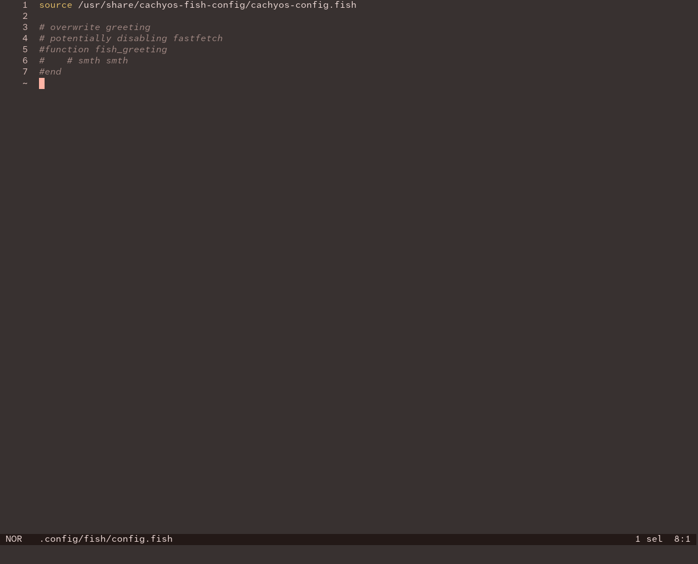
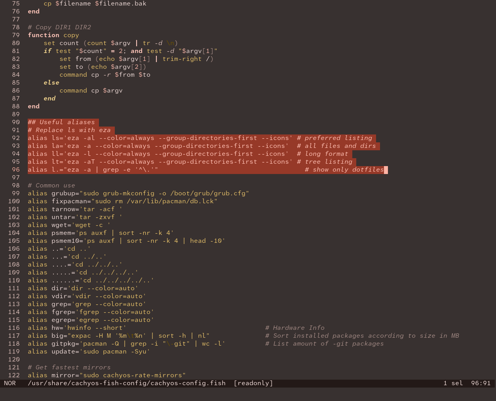
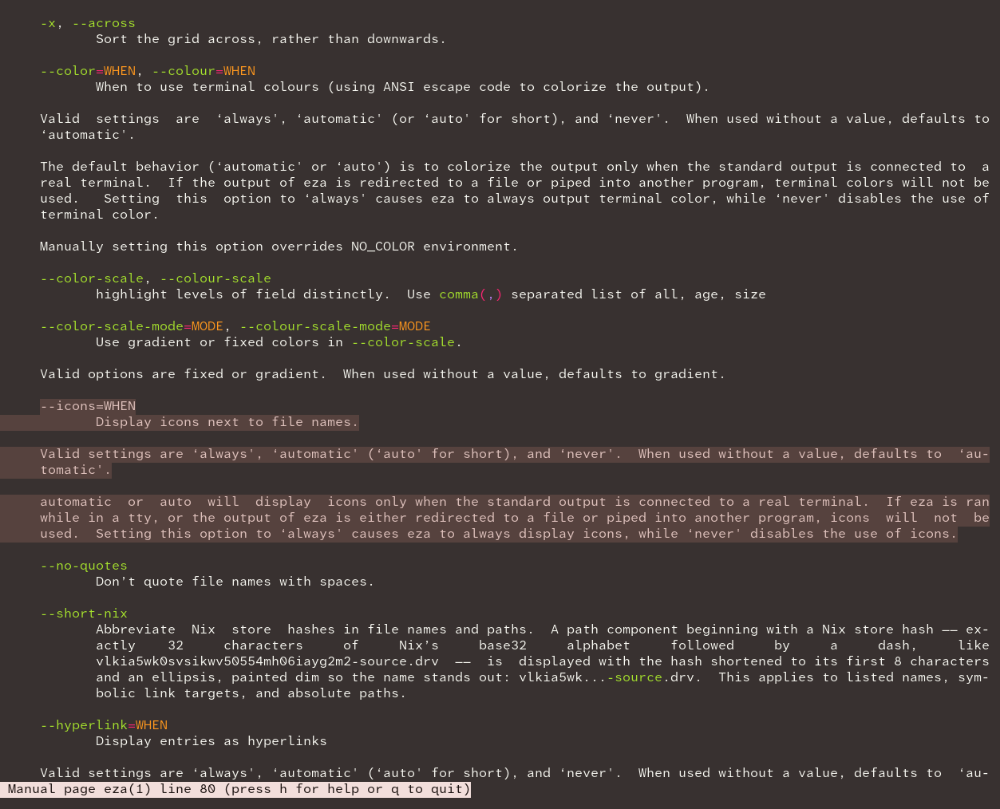
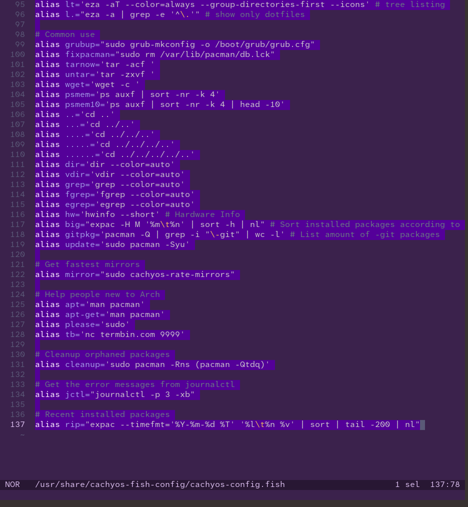
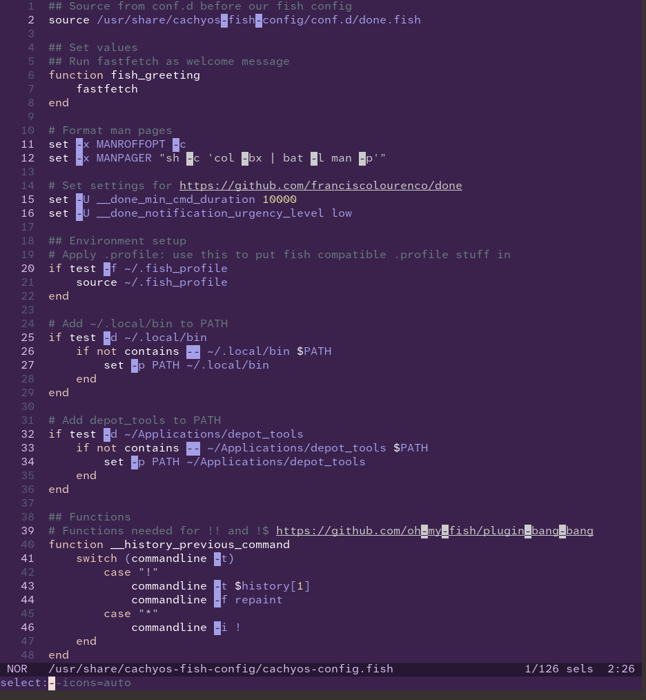
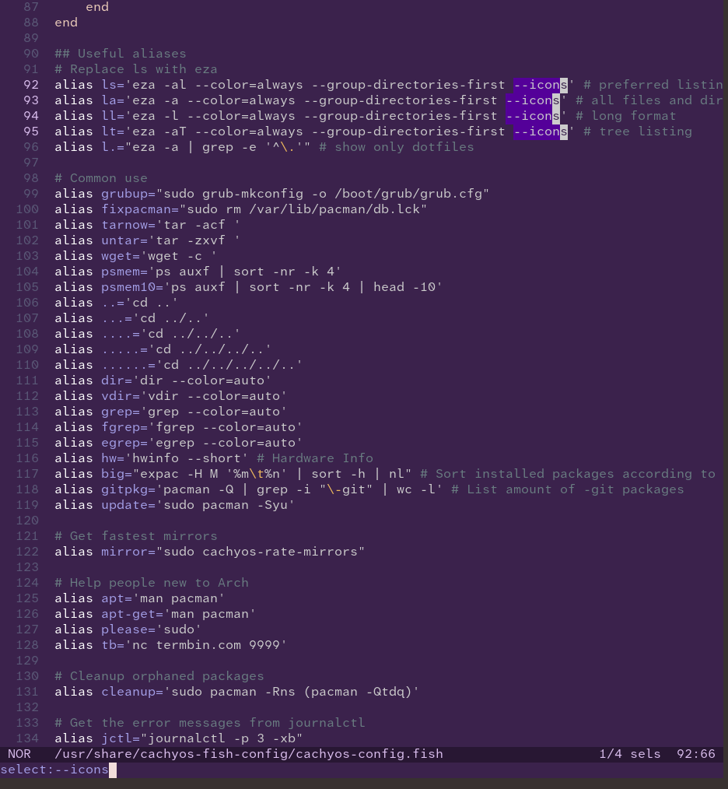
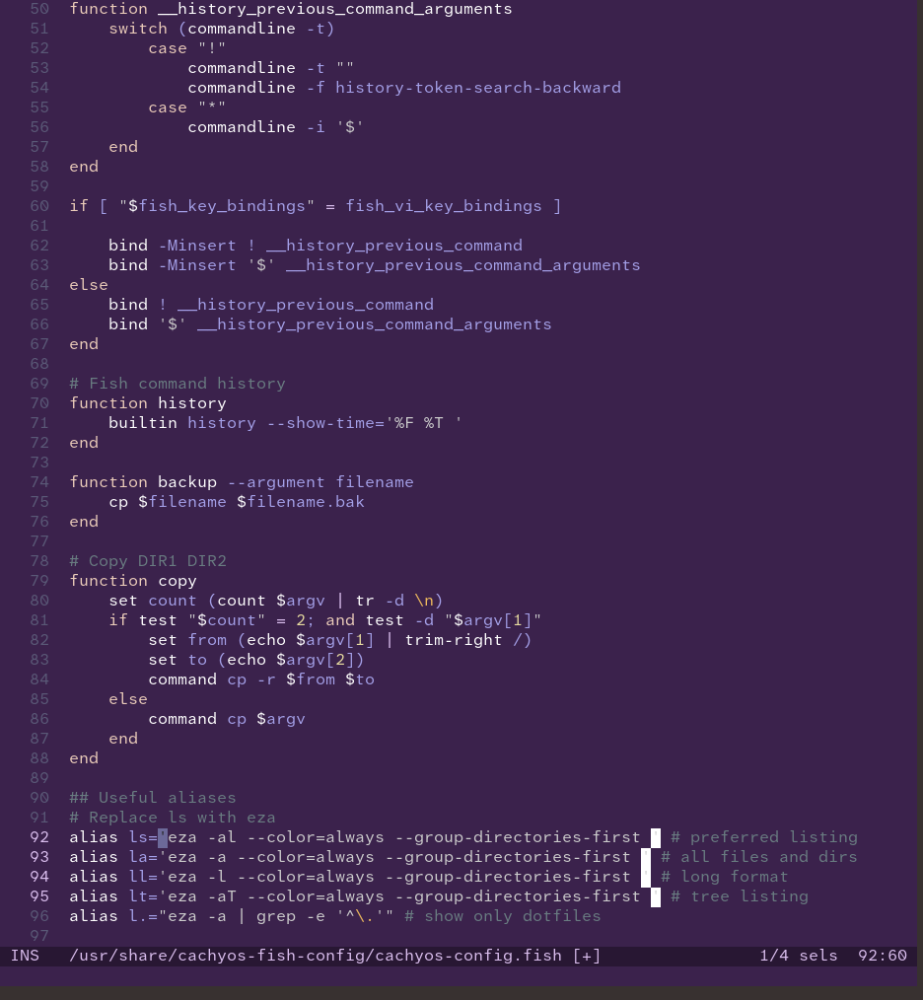
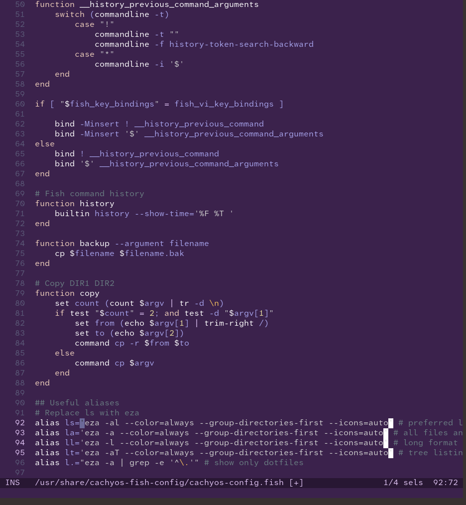
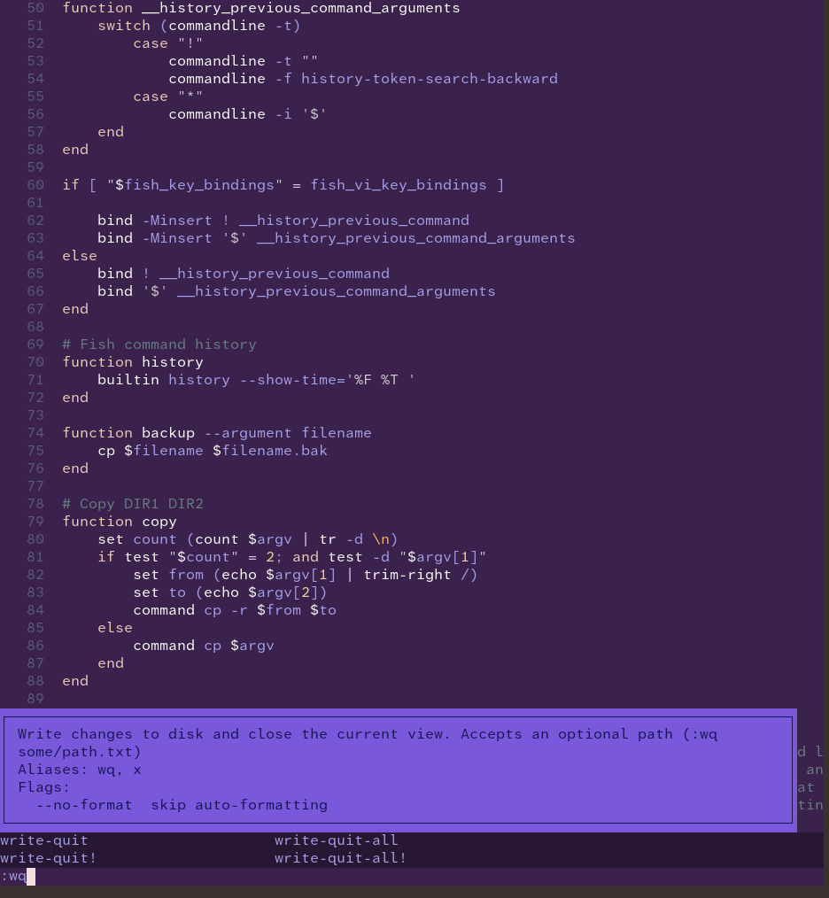
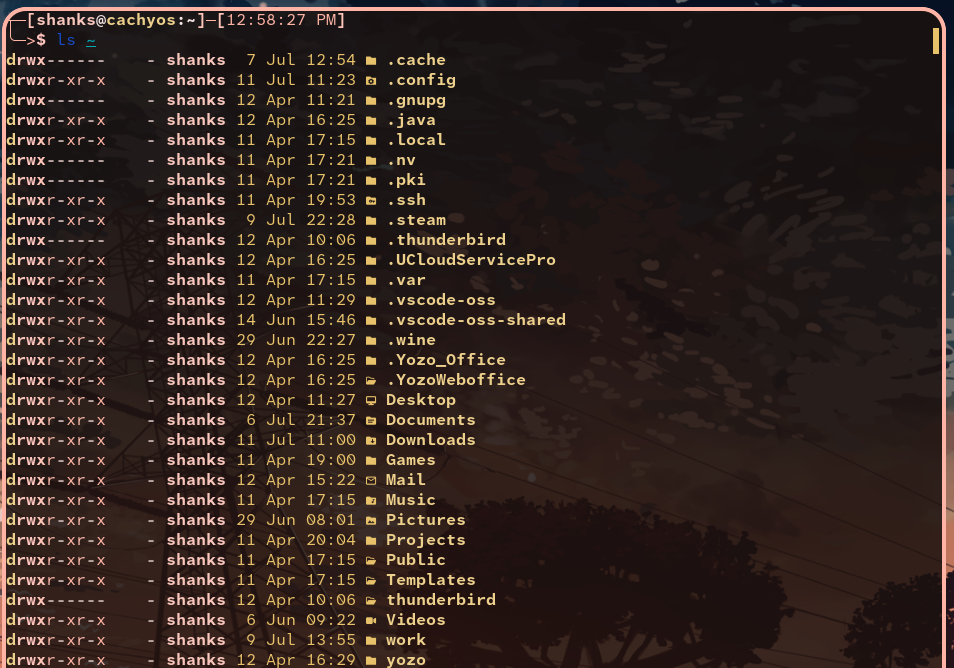

## Problem Statement :

On CachyOS, as of 10th July, ls commands on certain directories fail with the error : 

```txt
error: invalid value ... for `--icons [<when>]`
  [possible values: always, auto, never]

For more information, try --help'.
```


## Solution :

I always thought ls was a simple command but never extented that thought as to how icons are displayed.

Started digging through fish config to see what alias was being done for ls.

```bash
helix ~/.config/fish/config.fish
```
Looks like the fish config is just a placeholder/proxy for CachyOS config


Opening the actual source file shows what's been going on under the hood.
```bash
helix /usr/share/cachyos-fish-config/cachyos-config.fish
```

Looking through the content of this config file shows the various aliases for ls
and how ls is not really ls at all but eza all along.



now that I knew it was eza, ran the manual for it to see what is missing with icons usage as that was the error.

```bash
man eza
```

Voila ! Icons need a parameter now but the aliases above (lines 90 - 96) dont have any such selections.



I dont want to set always because the terminal output might become garbage when running through tty. Setting it to automatic makes a lot of sense.

So let's edit it and set it to auto. `sudo` is needed here because its a read-only path for normal users. It is also why helix reverted to default purple theme because its running as root and root has no themes set up.

### Using cool features of Helix to find and replace --icons text :

```bash
sudo helix /usr/share/cachyos-fish-config/cachyos-config.fish
```

**Step 1:** Press `%` in Normal mode to select everything.


---

**Step 2:** Press `s` to enter select mode.


---

**Step 3:** Type out `--icons` to select the desired text.


---

**Step 4:** Press `c` to change them.


---

**Step 5:** Type out `--icons=auto` to replace.


---

**Step 6:** Type `:wq` to write and quit.


Loading up the config values again to this shell and ls is now fixed!

```bash
source ~/.config/fish/config.fish
```

